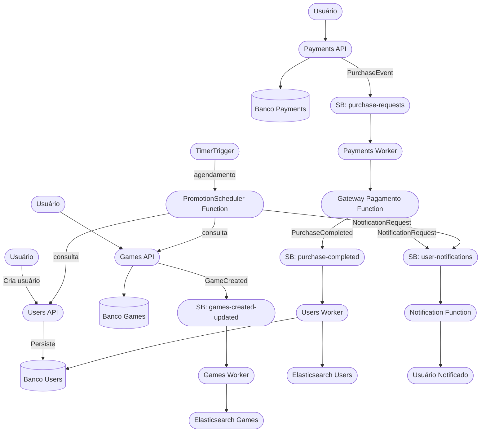
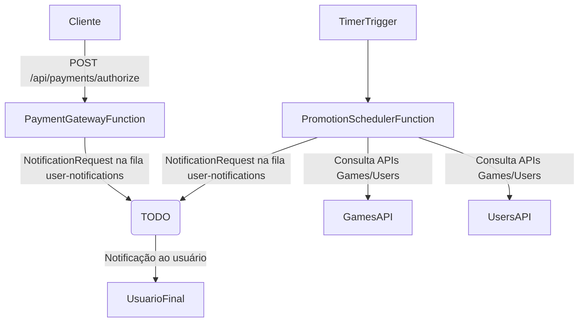

# Arquitetura de Dados – Fiap Cloud Games (Games Service)

## Visão Geral
O serviço **fiap-cloud-game-games** faz parte de uma arquitetura baseada em microsserviços para gerenciamento de jogos, utilizando APIs, mensageria, bancos relacionais e mecanismos de busca para garantir escalabilidade, desacoplamento e performance.

---

## Fluxo de Dados – Criação de Game

1. **Requisição do Usuário**
   - O usuário realiza uma chamada HTTP para a Games API (ex: `POST /games`).

2. **Processamento pela API**
   - A API valida e processa os dados recebidos.
   - Após validação, persiste o game no banco relacional (SQL Server/Azure SQL).

3. **Publicação de Evento**
   - A API publica um evento `GameCreated` no Azure Service Bus, tópico **games-created-updated**.

4. **Consumo do Evento**
   - Um ou mais consumidores (ex: Azure Function, Worker Service) recebem o evento do Service Bus.
   - O consumidor pode:
     - Persistir/atualizar o game no Elasticsearch para buscas rápidas.
     - Realizar integrações com outros sistemas (ex: analytics, notificações).

5. **Sincronização e Outras Ações**
   - Outros serviços podem consumir o mesmo evento para atualizar caches, enviar notificações, etc.

---

## Componentes Envolvidos
### Games
- **Games API**: Responsável por expor endpoints REST para operações de jogos.
- **Service Bus**: Mensageria para desacoplamento e comunicação assíncrona. Utiliza o tópico **games-created-updated**.
- **Consumer/Worker**: Serviços que processam eventos e realizam integrações/persistências adicionais.
- **Banco Relacional**: Fonte de verdade dos dados (SQL Server/Azure SQL). Principais tabelas: **Games**, **Promotions**.
- **Elasticsearch**: Indexação e busca rápida de jogos. Índice principal: **games**.

### Payments
- **Payments API**: Responsável por expor endpoints REST para operações de compra.
- **Service Bus**: Utiliza a fila **purchase-requests** (e opcionalmente **purchase-completed**) para eventos de compra.
- **Worker Service**: Processa eventos de compra, consulta tabelas e integra com o gateway de pagamento.
- **Banco Relacional**: Fonte de verdade dos dados (SQL Server/Azure SQL). Principais tabelas: **PurchaseGames**, **Games**, **Users**, **Promotions**.
- **Gateway de Pagamento**: Azure Function simulada para autorização de pagamentos.

### Users
- **Users API**: Responsável por expor endpoints de usuário (criação/alteração/consulta).
- **Auth API**: Responsável por Autenticação.
- **Worker Service**: Processa eventos de compra criar biblioteca do usuário.
- **Banco Relacional**: Fonte de verdade dos dados (SQL Server/Azure SQL). Principais tabelas: **PurchaseGames**, **Games**, **Users**, **Promotions**.
- **ElasticSearch**: Indexação e busca rápida da biblioteca 
---

## Diagrama Integrado – Fluxo de Dados Completo

---

### Diagrama Mermaid – Azure Functions

